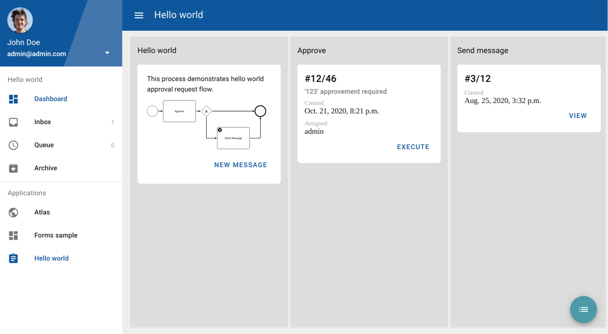
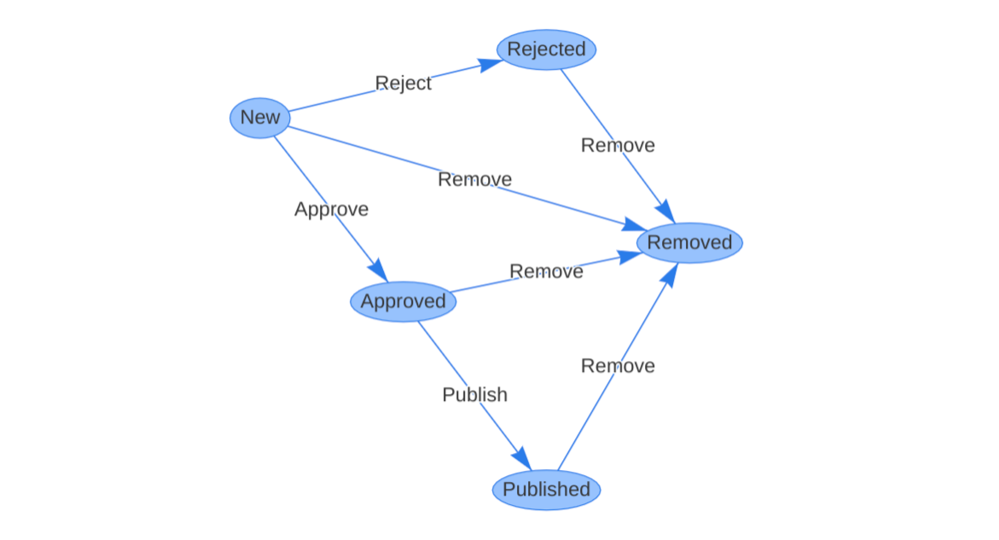
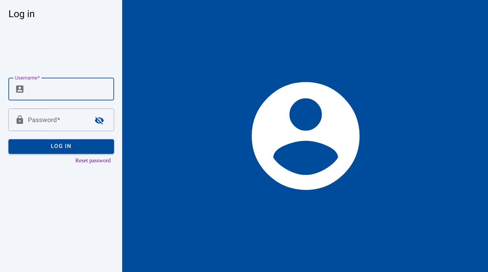
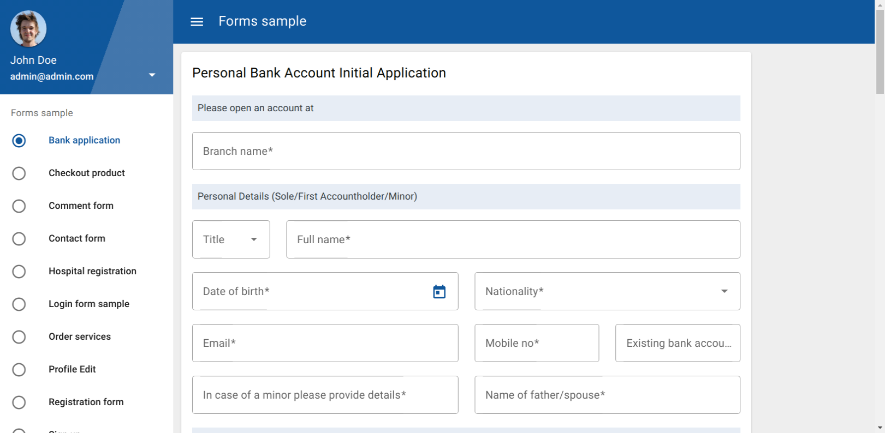

# Viewflow
**The Django extension for perfectionists with yesterday’s deadlines.**

Viewflow is a reusable library that makes it easy to build business applications fast. Viewflow helps to implement collaboration and approval workflows, CRUD, and reporting.

The goal of Viewflow to stay small, flexible, and let you create Django applications as quickly as with no-code solutions.

Viewflow has a pre-built UI and assumes that you can implement your own.

[![travis-svg]][travis] [![requirements-svg]][requirements] [![pypi-version]][pypi] [![py-versions]][pypi]


Viewflow comes in two flavors:
- Open-source library with only non-opinionated core classes that allows you to build
  your custom solution on top.
- PRO: Reference functionality implementation. Integrated with third-party Django packages included.


## Installation

Viewflow works with Python 3.7 or greater and Django 3.2+

Viewflow:

    pip install django-viewflow --pre

Viewflow-PRO

    pip install django-viewflow-pro  --extra-index-url https://pypi.viewflow.io/<licence_id>/simple/ --pre

## Quickstart

You can get a bare minimum, pre-configured Django project with Viewflow enabled
with the following command:

    npm init django project_name --viewflow

just replace "project_name"  with the desired name of your application module.

## Documentation

http://docs-next.viewflow.io/


## Demo

http://demo-next.viewflow.io/

## Cookbook

Samples applications code for Viewflow PRO available at:

http://cookbook.viewflow.io


## Components

### BPMN Workflow

`viewflow.workflow.*` is a lightweight workflow layer on top of Django's Model-View-Template that helps to organize people's collaboration business logic.

<a href="https://demo-next.viewflow.io/helloworld/">
  
</a>

The workflow layer separates collaboration logic from the views code.

```python
def approve_task(request, process_pk, task_pk):
     form = ApproveForm(request.POST or None)
     if form.is_valid():
         form.save()
         request.activation.done()  # <- complete workflow task
         return redirect('/')
     return render(request, {
         'activation': request.activation,
         'form': form,
     })
```

Viewflow supports parallel activities, allows having multiple active tasks at
the same time, and synchronizing people's interactions with background Python jobs.

```python
class HelloWorldFlow(flow.Flow):
    start = (
        flow.Start(
            views.CreateProcessView.as_view(
                fields=['text']
            )
        )
        .Permission(auto_create=True)
        .Next(this.approvement_split)
    )

    ...

urlpatterns = [
    path(
        'flow/',
        FlowAppViewset(
            HelloWorldFlow, icon=Icon('assignment')
        ).urls
    ),
    path('accounts/', AuthViewset().urls),
    path('', site.urls),
]
```

Quickstart: https://docs-next.viewflow.io/bpmn/quick_start.html


### Class-based URL Configuration

A class with `.urls` property, suitable for inclusion into `urlpatterns`

Same concept as Django's class-based views but for URL routing configuration. Generalization of `admin.urls` and REST framework routers.

Class-based URL configuration allows you to quickly include existing applications into a website, configure, subclass, and redefine its functionality.

Viewflow contains several pre-built URL configurations for building a Site Menu structure, CRUD functionality, and quickly enables user interfaces for BPMN and FSM Workflows, along with many third-party apps.

```python
from viewflow.contrib.auth import AuthViewset
from viewflow.urls import Application, Site, Viewset

class WebsiteViewset(Viewset):
    index_url = path('', index_view, name='index')

site = Site(title="ACME Corp", viewsets=[
    Application(
        title='Sample App',
        icon=Icon('people'),
        app_name='emp',
        viewsets=[
            WebsiteViewset(),
        ]
    ),
])

urlpatterns = [
    path('', site.urls),
    path('accounts/', AuthViewset(
        allow_password_change=True,
        with_profile_view=True
    ).urls),
]
```

See more at - https://docs-next.viewflow.io/frontend/viewset.html

### Finite State Machine

Finite state machine workflows are the declarative way to describe consecutive operations through a set of states and transitions between them.

<a href="https://demo-next.viewflow.io/admin/review/review/">
  
</a>

`viewflow.fsm.*` can help you manage rules and restrictions around moving from one state to another. The package is suitable for getting low-level, database-independent FSM implementation or to wrap an existing database model and implement a simple, persistent workflow process with a quickly bootstrapped UI.

```python
from enum import Enum
from viewflow.fsm import State

class Stage(Enum):
   NEW = 1
   DONE = 2
   HIDDEN = 3


class MyFlow(object):
    stage = State(Stage, default=Stage.NEW)

    @stage.transition(source=Stage.NEW, target=Stage.DONE)
    def complete(self):
        pas

    @stage.transition(source=State.ANY, target=Stage.HIDDEN)
    def hide(self):
        pass

flow = NyFlow()
flow.stage == Stage.NEW  # True
flow.stage = Stage.DONE  # Raises AttributeError

flow.complete()
flow.stage == Stage.DONE  # True

flow.complete()  # Now raises TransitionNotAllowed
```

### JSON Storage for Django Models
Maintain dumb business data and quick prototyping without DB migrations.

`viewflow.jsonstore.*` is the set of virtual Django Model fields that stores data inside a single JSON database column.

```python
from viewflow import jsonstore
from django.db import models

class Employee(models.Model):
    data = JSONField(default={})
    full_name = jsonstore.CharField(max_length=250)
    hire_date = jsonstore.DateField()
```
The result model works like a usual Django model. All virtual fields are available to construct ModelForms, Viewsets, and Admin interfaces.

```python
class EmployeeForm(forms.ModelForm):
    class Meta:
        model = Employee
        fields = ['full_name', 'hire_date', 'salary']

@admin.register(Employee)
class EmployeeAdmin(admin.ModelAdmin):
    list_display = ['full_name', 'hire_date']
    fields = ['full_name', ('hire_date', 'salary')]
```
See more at: https://docs-next.viewflow.io/json_storage.html

### Material UI Kit

Viewflow provides a theme kit based on Google Material Design components. Base page templates, Login, Logout, Password management views, Dashboard, Forms, and CRUD.

SPA look and feel with Turbolinks-enabled navigation and form processing.

All JavaScript is managed by Web Components based on Solid-JS library.

<p>
<a href="https://demo-next.viewflow.io/accounts/login/">
  
</a>
<a href="https://demo-next.viewflow.io/atlas/city/">
  
</a>
<a href="https://demo-next.viewflow.io/forms/bank/">
  
</a>
</p>

Documentation: https://docs-next.viewflow.io/frontend/index.html


## License

Viewflow is an Open Source project licensed under the terms of
the AGPL license - `The GNU Affero General Public License v3.0
<http://www.gnu.org/licenses/agpl-3.0.html>`_ with the Additional Permissions
described in `LICENSE_EXCEPTION <./LICENSE_EXCEPTION>`_

You can read more about AGPL at `AGPL FAQ <http://www.affero.org/oagf.html>`_
This package license scheme follow GCC Runtime library licensing. If you use Linux already, this package license likely won't bring anything new to your stack.

Viewflow PRO has a commercial-friendly license allowing private forks
and modifications of Viewflow. You can find the commercial license terms in COMM-LICENSE.


## Latest Changelog

### 2020-XX-XX

  * Work in progress


[travis-svg]: https://travis-ci.org/viewflow/viewflow.svg
[travis]: https://travis-ci.org/viewflow/viewflow
[pypi]: https://pypi.org/project/django-viewflow/
[pypi-version]: https://img.shields.io/pypi/v/django-viewflow.svg
[py-versions]: https://img.shields.io/pypi/pyversions/django-viewflow.svg
[requirements-svg]: https://requires.io/github/viewflow/viewflow/requirements.svg?branch=v2
[requirements]: https://requires.io/github/viewflow/viewflow/requirements/?branch=v2
