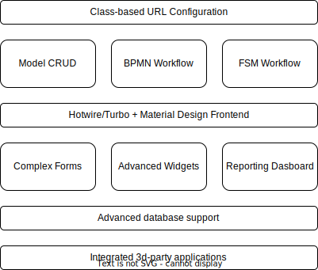

# Viewflow

**The low-code for developers with yesterday's deadline**

Viewflow is a reusable component library for Django web framework allows to
create full-featured business applications in a few lines of code. Viewflow helps
to implement collaboration and approval workflows, CRUD, and reporting.

The goal of Viewflow to stay small, flexible, and let you create Django
applications as quickly as no-code solutions.

Like Django, Viewflow shipped as a single package with batteries included. Each
part Viewflow can be used independently of each other, but they all work well
together.

[![build]][build] [![coverage]][coverage] [![pypi-version]][pypi] [![py-versions]][pypi]


Viewflow comes in two flavors:
- Open-source library with only non-opinionated core classes that allows you to build
  your custom solution on top.
- PRO: Reference functionality implementation. Integrated with third-party Django packages included.


## Installation

Viewflow works with Python 3.8 or greater and Django 4.0+

Viewflow:

    pip install django-viewflow --pre

Viewflow-PRO

    pip install django-viewflow-pro  --extra-index-url https://pypi.viewflow.io/<licence_id>/simple/ --pre


## Documentation

Full documentation for the PRO version available at http://docs-next.viewflow.io/

## Demo

http://demo-next.viewflow.io/

## Cookbook

Samples applications code for Viewflow PRO available at:

http://cookbook.viewflow.io


## Components



### Class-based URL configurations

Viewflow is built around a simple concept - Class-based URL Configuration or
Viewset.

Viewsets allow you to compose pre-built components into a working solution, but
retain the ability to customize ond override any existing functionality.

```python
from django.urls import path
from viewflow.urls import Viewset

class RootViewset(Viewset):
    app_name = 'root'

    index_path = path('', TemplateView.as_view(
        template_name='viewflow/base.html'
    ), name="index")

    list_view_class = ListView

    @property
    def list_path(self):
        return path('list/', self.list_view_class.as_view(), name='list')

urlpatterns = [
    path('', RootViewset(list_view_class=MyListView).urls)
]
```

Viewset class collects all own attributes with names ending on `_path` into a
patterns list, suitable to include into django URL configuration. You can use
inheritances to override part of Viewset functionality or add new views into it.
To change a few attributes on a Viewset, you can pass them into the
constructor() call itself.

### Model CRUD

Set of pre-built viewsets and mixins to organize user interface interface for django models.

```python
from viewflow.urls import DetailViewMixin, DeleteViewMixin, ModelViewset
from .models import City

class CityViewset(DetailViewMixin, DeleteViewMixin, ModelViewset):
    model = models.City
    create_view_class = MyCreateView
    list_columns = ('name', 'country', 'population')
    list_filter_fields = ('is_capital', 'country', )
    list_search_fields = ['name']
    queryset = City._default_manager.select_related('country')

ocean_viewset = ReadonlyModelViewset(
    app_name='ocean',
    model=models.Ocean,
    list_columns=('name', 'area',),
)

urlpatterns = [
    path('cities', CityViewset().urls)
    path('oceans/', ocean_viewset.urls)
]
```

You can use it directly inside your root URL configuration or within the
Viewflow Frontend (see below)


### Finite State Machine Workflow

<a href="https://demo-next.viewflow.io/admin/review/review/">
  
</a>

FSM Workflow is the way to organize series of activities that are necessary to
complete a task. FSM process execution supports only one single active state in
time. Viewflow decompose FSM into a FSM definition class, django model (or
any other) for storage, and FSM Viewset for user interface.

```python
from enum import Enum
from viewflow.fsm import State

class State(Enum):
   NEW = 1
   DONE = 2
   HIDDEN = 3


class ReviewFlow(object):
   state = State(Stage, default=Stage.NEW)

   @state.transition(source=Stage.NEW, target=Stage.DONE)
   def complete():
       pass

   @state.transition(source=State.ANY, target=Stage.HIDDEN)
   def hide():
       pass

flow = ReviewFlow()
flow.stage == State.NEW  # True
flow.stage = State.DONE  # Raises AttributeError

flow.complete()
flow.state == State.DONE  # True

flow.complete()  # Now raises TransitionNotAllowed
```

`viewflow.fsm.*` can help you manage rules and restrictions around moving from
one state to another. The package is suitable for getting low-level,
database-independent FSM implementation or to wrap an existing database model
and implement a simple, persistent workflow process with a quickly bootstrapped
UI.


```python
class Report(models.Model):
    ...
    state = models.CharField(max_length=50)

class ReviewFlow(object):
    ...
    def __init__(self, report):
        self.report = report

    @state.setter()
    def _set_report_stage(self, value):
        self.report.stage = value

    @state.getter()
    def _get_report_stage(self):
        return self.report.stage

class ReviewViewset(FlowViewsMixin, CreateViewMixin, ReadonlyModelViewset):
    def get_object_flow(self, request, obj):
        return ReviewFlow(obj)

urlpatterns = [
    path('review/', ReviewViewset().urls)
]
```

### BPMN Workflow

<a href="https://demo-next.viewflow.io/helloworld/">
  
</a>

lightweight workflow layer on top of Django's Model-View-Template that helps to
organize people's collaboration business logic. BPMN workflows supports parallel
execution with multiple tasks active at the same time. Viewflow defines Nodes
(which is a viewset) that can be composed into a Flow (thats is also viewset).
Multiple flows could be combined into FlowViewset to get a ready to use
interface for a user.

```python
from viewflow import this
from viewflow.contrib import celery
from viewflow.workflow import flow

class Workflow(flow.Flow):
    start = (
        flow.Start(start_view)
        .Permission("workflow.can_start_request")
        .Next(this.process)
    )

    process = celery.Job(process_request).Next(this.end)

    end = flow.End()
```

Viewflow extracts workflow and permission logic out of views into the new BFlow
layer. Same view could be reused in a different parts of workflow process. A
process specific data is handles as `request.activation` object. The
`request.activation.execute()` should be called on as soon as a user completes
the task.

```python
def start_view(request, **kwargs):
    request.activation.prepare(request.POST or None, user=request.user)
    form = StartForm(request.POST or None)

    if form.is_valid():
        artifact = form.save()
        activation.process.artifact = artifact
        request.activation.execute()

        return redirect(
            request.resolver_match.flow_viewset.get_next_task_url(request)
        )

    return render(request, 'viewflow/workflow/task.html', {
        'form': form,
        'activation': request.activation
    })
```

### Material Frontend

Viewflow provides a theme kit based on Google Material Design components. Base
page templates, Login, Logout, Password management views, Dashboard, Forms, and
CRUD.

hotwire/turbo-enabled navigation and form processing provides SPA look and feel
for a common Django application.

<p>
<a href="https://demo-next.viewflow.io/accounts/login/">
  
</a>
<a href="https://demo-next.viewflow.io/atlas/city/">
  
</a>
<a href="https://demo-next.viewflow.io/forms/bank/">
  
</a>
</p>

To define site structure and menu content, you can combine several Viewsets
into an Application Viewset. Several applications could be combined in a Site
Viewset.

```python
from viewflow.contrib.admin import Admin
from viewflow.contrib.auth import AuthViewset
from viewflow.urls import Site

atlas = Application(
    title='CRUD sample',
    app_name='atlas',
    permission='atlas.can_view_city',
    viewsets=[
        CityViewset(),
    ]
)

site = Site(
    title="CRUD 101 Demo",
    primary_color='#3949ab',
    secondary_color='#5c6bc0',
    viewsets=[
        atlas,
        Admin(),
    ]
)

urlpatterns = [
    path('', site.urls),
    path('accounts/', AuthViewset(
        allow_password_change=True,
        with_profile_view=True
    ).urls),
]
```

### Complex Forms

An extension for Django forms rending allows to declaratively modify form layout
and create a forms of any complexity without a single line of HTML/CSS

```python
class AddressForm(forms.Form):
    line_1 = forms.CharField(max_length=250)
    line_2 = forms.CharField(max_length=250)
    state = forms.CharField(max_length=100)
    city = forms.CharField(max_length=100)
    zipcode = forms.CharField(max_length=10)

    layout = Layout(
        Caption('Address'),
        Row(Column('line_1', 'line_2',), 'state'),
        Row('city', 'zipcode'),
    )
```

PRO Version adds the ability to combine forms and define dynamic formsets

```python
AddressFormSet = forms.formset_factory(AddressForm, extra=3, can_delete=True)

class SignupForm(Form):
    username = forms.CharField(
        max_length=50,
        widget=forms.TextInput(attrs={'leading-icon': 'account_box'}),
    )
    first_name = forms.CharField(max_length=250)
    last_name = forms.CharField(max_length=250)
    date_of_birth = forms.DateField()
    emails = FormSetField(formset_class=EmailFormSet)
    addresses = FormSetField(formset_class=AddressFormSet)

    layout = Layout(
        'username',
        Row('first_name', 'last_name', 'date_of_birth'),
        'emails',
        FormSet('addresses', card_desktop=4),
    )
```

### Advanced widgets

Available in the PRO version only

### Reporting Dashboard

Simple and lightweight interactive Plotly dashboards integration into Django
application and Material Frontend

```python
from viewflow.contrib.plotly import Dashboard, material

class DjangoStatsDashboard(Dashboard):
    app_name = 'django_stats'
    title = 'Django User Statistics'
    icon = 'public'

    def layout(self):
        return material.PageGrid([
            material.InnerRow([
                material.Span4([self.badge('Users registered', 'person', self.users_count())]),
                ...
            )
        )

    def users_count(self):
        return User.objects.filter(is_active=True).count()

site = Site(
    viewsets=[
        Application(
            title='Dashboard',
            viewsets=[
                DjangoStatsDashboard(),
            ]
        ),
        Admin(),
    ]
)

urlpatterns = [
    path('', site.urls),
]

```

### Advanced DB support

#### JsonField
Maintain dumb business data and quick prototyping without DB migrations.

`viewflow.jsonstore.*` is the set of virtual Django Model fields that stores data inside a single JSON database column.

```python
from viewflow import jsonstore
from django.db import models

class Employee(models.Model):
    data = JSONField(default={})
    full_name = jsonstore.CharField(max_length=250)
    hire_date = jsonstore.DateField()
```
The result model works like a usual Django model. All virtual fields are available to construct ModelForms, Viewsets, and Admin interfaces.

```python
class EmployeeForm(forms.ModelForm):
    class Meta:
        model = Employee
        fields = ['full_name', 'hire_date', 'salary']

@admin.register(Employee)
class EmployeeAdmin(admin.ModelAdmin):
    list_display = ['full_name', 'hire_date']
    fields = ['full_name', ('hire_date', 'salary')]
```
See more at: https://docs-next.viewflow.io/json_storage.html

#### Composite Foreign Keys support

Provide a way to connect a django model to a legacy database table without single primary key column.
Also works with TimescaleDB tables.

```python
from viewflow.fields import CompositeKey

class Seat(models.Model):
    id = CompositeKey(columns=['aircraft_code', 'seat_no'])
    aircraft_code = models.ForeignKey(
        Aircraft, models.DO_NOTHING,
        db_column='aircraft_code'
    )
    seat_no = models.CharField(max_length=4)

    class Meta:
        managed = False
        db_table = 'seats'
        unique_together = (('aircraft_code', 'seat_no'),)


@admin.register(models.Seat)
class SeatAdmin(admin.ModelAdmin):
    pass
```
CompositeKey field, opens a way to use such models in a Viewflow CRUD and Django
admin. Viewflow does not provide a way to create such models during migration.

### Integrated 3d-party applications
Available in the PRO version only

## License

Viewflow is an Open Source project licensed under the terms of
the AGPL license - `The GNU Affero General Public License v3.0
<http://www.gnu.org/licenses/agpl-3.0.html>`_ with the Additional Permissions
described in `LICENSE_EXCEPTION <./LICENSE_EXCEPTION>`_

You can read more about AGPL at `AGPL FAQ <http://www.affero.org/oagf.html>`_
This package license scheme follow GCC Runtime library licensing. If you use Linux already, this package license likely won't bring anything new to your stack.

Viewflow PRO has a commercial-friendly license allowing private forks
and modifications of Viewflow. You can find the commercial license terms in COMM-LICENSE.


## Changelog

[2022-11-XX] Work in progress

[build]: https://img.shields.io/github/workflow/status/viewflow/viewflow/Viewflow%20CI
[coverage]: https://img.shields.io/coveralls/github/viewflow/viewflow/v2
[travis-svg]: https://travis-ci.org/viewflow/viewflow.svg
[travis]: https://travis-ci.org/viewflow/viewflow
[pypi]: https://pypi.org/project/django-viewflow/
[pypi-version]: https://img.shields.io/pypi/v/django-viewflow.svg
[py-versions]: https://img.shields.io/pypi/pyversions/django-viewflow.svg
[requirements-svg]: https://requires.io/github/viewflow/viewflow/requirements.svg?branch=v2
[requirements]: https://requires.io/github/viewflow/viewflow/requirements/?branch=v2
