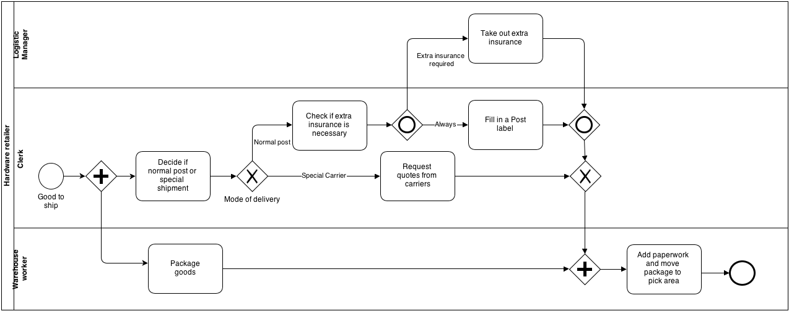

# Viewflow

**The low-code for developers with yesterday's deadline**

[![build]][build] [![coverage]][coverage] [![pypi-version]][pypi] [![py-versions]][pypi]


Viewflow is a low-code, reusable component library for creating comprehensive business applications with ease. Built on top of Django, Viewflow simplifies development by providing pre-built components for user management, workflows, and reporting, while still offering flexibility to customize and integrate with existing systems.

With Viewflow, you can create full-featured business applications in just a few lines of code using its reusable component library. It's shipped as a single package with batteries included, and each part of Viewflow can be used independently of the others, but they all work well together.

GPT assisted with Viewflow documentation: [Viewflow Pair Programming Buddy][gpt]


Viewflow comes in two flavors:
- **Viewflow Core:** A lightweight, open-source library with only non-opinionated core classes that allows you to build your custom solution on top.
- **Viewflow PRO:** A comprehensive package that includes reference functionality implementation and integrated with third-party Django packages. This package has a commercial-friendly license that allows private forks and modifications of Viewflow.



## Features

- Modern, responsive user interface with an SPA-style look and feel
- Reusable workflow library for quick implementation of BPMN workflows
- Built-in customizable CRUD for managing complex forms and data
- Integrated reporting dashboard
- Small and concise API


## Installation

Viewflow works with Python 3.8 or greater and Django 4.0+

Viewflow:

    pip install django-viewflow

Viewflow-PRO:

    pip install django-viewflow-pro  --extra-index-url https://pypi.viewflow.io/<licence_id>/simple/

Add 'viewflow' and, in case you need workflow capabilities 'viewflow.workflow' to the INSTALLED_APPS settings.py

```python
    INSTALLED_APPS = [
        ....
        'viewflow',
        'viewflow.workflow',
    ]
```


## Quick start

Here's an example of how to create a simple pizza ordering workflow using Viewflow:

1. Create a model to store process data

Before creating the workflow, you'll need to define a model to store the process
data. Viewflow provides a Process model as the base model for your process
instances. You can add your own fields to the model using jsonstore fields to
avoid model inheritance and additional joins:

```python

    from viewflow import jsonstore
    from viewflow.workflow.models import Process

    class PizzaOrder(Process):
        customer_name = jsonstore.CharField(max_length=250)
        address = jsonstore.TextField()
        toppings = jsonstore.TextField()
        tips_received = jsonstore.IntegerField(default=0)
        baking_time = jsonstore.IntegerField(default=10)

        class Meta:
            proxy = True
```

2. Create a new flow definition file flows.py

Next, create a new flow definition file *flows.py* and define your workflow. In
this example, we'll create a PizzaFlow class that inherits from flow.Flow.
We'll define three steps in the workflow: start, bake, and deliver. We'll
use CreateProcessView and UpdateProcessView to create and update the process
data from PizzaOrder:

```python

    from viewflow import this
    from viewflow.workflow import flow
    from viewflow.workflow.flow.views import CreateProcessView, UpdateProcessView
    from .models import PizzaOrder

    class PizzaFlow(flow.Flow):
        process_class = PizzaOrder

        start = flow.Start(
            CreateProcessView.as_view(
                fields=["customer_name", "address", "toppings"]
            )
        ).Next(this.bake)

        bake = flow.View(
            UpdateProcessView.as_view(fields=["baking_time"])
        ).Next(this.deliver)

        deliver = flow.View(
            UpdateProcessView.as_view(fields=["tips_received"])
        ).Next(this.end)

        end = flow.End()
```

3. Add the flow to your URL configuration:

Finally, add the PizzaFlow to your URL configuration. You can use the Site and
FlowAppViewset classes to register your workflow with the pre-built frontend.

```python

    from django.urls import path
    from viewflow.contrib.auth import AuthViewset
    from viewflow.urls import Application, Site
    from viewflow.workflow.flow import FlowAppViewset
    from my_pizza.flows import PizzaFlow

    site = Site(
        title="Pizza Flow Demo",
        viewsets=[
            FlowAppViewset(PizzaFlow, icon="local_pizza"),
        ]
    )

    urlpatterns = [
        path("accounts/", AuthViewset().urls),
        path("", site.urls),
    ]

```

4. Make and run migrations and access the workflow through the pre-built frontend.

Make and run migrations to create the necessary database tables, then start your Django
server and access the workflow through the pre-built frontend. You should be
able to create and track pizza orders with the workflow.

Go to the https://docs.viewflow.io/workflow/writing.html for the next steps

## Documentation

Viewflow's documentation for the latest version is available at
http://docs.viewflow.io/

Documentarian for Viewflow  1.xx  series available at http://v1-docs.viewflow.io


## Demo

http://demo.viewflow.io/

## Cookbook

For sample applications and code snippets, check out the Viewflow PRO cookbook at

https://github.com/viewflow/cookbook


## License

Viewflow is an Open Source project licensed under the terms of the AGPL license - [The GNU Affero General Public License v3.0](http://www.gnu.org/licenses/agpl-3.0.html) with the Additional Permissions
described in [LICENSE_EXCEPTION](./LICENSE_EXCEPTION)

The AGPL license with Additional Permissions is a free software license that
allows commercial use and distribution of the software. It is similar to the GNU
GCC Runtime Library license, and it includes additional permissions that make it
more friendly for commercial development.

You can read more about AGPL and its compatibility with commercial use at the
[AGPL FAQ](http://www.affero.org/oagf.html)

If you use Linux already, this package license likely won't bring anything new to your stack.

Viewflow PRO has a commercial-friendly license allowing private forks and
modifications of Viewflow. You can find the commercial license terms in
[COMM-LICENSE](./COMM-LICENSE).

## Changelog

## 2.3.0 GIT Version

- Added FormAjaxCompleteMixin, FormDependentSelectMixin to default create and update workflow process views
- Extended patterns demo with user resources allocation samples https://demo.viewflow.io/patterns/resource_allocation/

### 2.2.9 2025-01-08

- Enhanced validation for flow_refs and task_refs to ensure accuracy and consistency.
- Resolved an issue with canceling processes containing revived tasks.
- Corrected the password reset confirmation email template for better functionality.
- Fixed multipart form type detection for forms with file fields in formsets.


### 2.2.8 2024-10-04

- Prevent exceptions from being raised by Process/Task models when a flow class
  is deleted but still referenced in the database.
- Fix serialization issue with jsonstore.DecimalField.
- Add missing 'index' view for celery.Task node.
- Enable recovery of flow.Subprocess and flow.NSubprocess nodes from error state.
- Correct invalid typing for FSM conditions.
- Allow setting permission=None in the FSM @transition decorator to explicitly bypass permission checks.
- Add support for MultiValueField and django-money fields form rendering


### 2.2.7 2024-08-16

- Added compatibility fix for Python 3.8.
- Extend documentation with data management explanation - https://docs.viewflow.io/workflow/data_flow.html
- Expanded documentation to cover permission management - https://docs.viewflow.io/workflow/permissions.html
- Introduced an experimental JSONEditorWidget.
- Fixed issue with saving the state of revived tasks.
- Enabled the option to cancel If tasks.
- Updated default FSM state change in FlowViewsMixin to now use transaction.atomic.
- Added support for using DependentModelSelect in formsets.
- Enabled AjaxModelSelect to function as a dependency for DependentModelSelect
- Corrected typo in the deletion success message.
- Test under django 5.1

### 2.2.6 2024-08-04

- Resolved the flow.If condition's this reference during class construction.
- Improved error handling when a Celery task finishes.
- Fixed an issue where errors occurring in a task after a successful celery.Job
  task incorrectly prevented the job task from being marked as completed, with
  the errored task correctly put into an error state.
- Redirect to the next process task now will take into account tasks in the ERROR state
- Add ability to revive flow.Function and flow.SplitFirst
- Fixed an error that occurred when a deleted process.artifact was referenced in
  the process field data listing within templates.
- Allow to cancel Subprocess tasks
- Allow to cancel Function tasks
- Allow custom task models inherited from AbstactTask have no .seed and .data fields

### 2.2.5 2024-07-17

- The 'pattern' widget attribute is now passed to the underlying form input.
- Fixed issue with flow image reload.
- Fixed dashboard max height on pages with long sidebars.
- Added .get_success_url(request) shortcut method to StartViewActivation and
  ViewActivation for convenient use in function-based views.
- Fixed duplicated task_finished signal on flow.View completion.
- Enabled callable defaults on jsonstore fields.
- Improved SVG and BPMN export shapes for SplitFirst and Timer Tasks.
- Created cookbook demo for common workflow patterns


### 2.2.4 2024-07-12

- Clone data, seed, and artifacts from canceled tasks to revived tasks.
- Enhance error handling for celery.Job.
- Improve the process cancellation template.
- Redirect to the task detail page after canceling or undoing actions, instead
  of redirecting to the process detail page.
- Added links to parent subprocess and parent task on the subprocess process and
  task details pages.
- Updated the Process.parent_task field to use related_name='subprocess',
  allowing access to subprocesses via task.subprocess
- Enhanced CreateProcessView and UpdateProcessView to set process_seed and
  artifact_generic_foreign_key fields based on form.cleaned_data, as Django
  model forms do not handle this automatically.
- Added tasks with an ERROR status to the process dashboard for better visibility and tracking.
- Added tooltip hover titles to nodes without text labels in the SVG workflow graph.
- Marked StartHandler nodes as BPMN Start Message events on the SVG graph.
- Fixed rendering of hidden field errors in forms.


### 2.2.3 2024-07-09

- Fixed issue with Split/Join operations when an immediate split to join
  connection occurs.
- Improved redirect functionality for "Execute and Continue." Now redirects to
  the process details if the process has finished.
- Enabled the Undo action for End() nodes.


### 2.2.2 2024-07-05

- Introduced new parameters for .If().Then(.., task_data=, task_seed) and
  .Else(...)
- Include {{ form.media }} into default workflow/task.html template


### 2.2.1 2024-07-03

- Introduced a new parameter for .Next(..., task_seed=) that allows the
  instantiation of new tasks with additional initialized .seed generic foreign key
- Introduced a new parameter for .Split(..., task_seed_source=) same as task_data_source,
  prodices outgoing tasks with initializaed .seed value
- Introduced a new parameter for flow.Subprocess(process_data=, process_seed=,
  task_data=, task_seed=) allows to provide data nad seed for newly created
  process and/or start task

### 2.2.0 2024-06-28

- Introduced a new parameter for .Next(..., task_data=) that allows the
  instantiation of new tasks with additional initialized .data, enabling data to
  be passed from task to task.
- Added process.seed and task.seed generic foreign keys to the default workflow
  models. Along with process.artifact and task.artifact, these additions enable
  tracking of business process results from start to finish.
- Renamed Split.Next(data_source=) to task_data_source=.


[build]: https://img.shields.io/github/actions/workflow/status/viewflow/viewflow/django.yml?branch=main
[coverage]: https://img.shields.io/coveralls/github/viewflow/viewflow/v2
[travis-svg]: https://travis-ci.org/viewflow/viewflow.svg
[travis]: https://travis-ci.org/viewflow/viewflow
[pypi]: https://pypi.org/project/django-viewflow/
[pypi-version]: https://img.shields.io/pypi/v/django-viewflow.svg
[py-versions]: https://img.shields.io/pypi/pyversions/django-viewflow.svg
[requirements-svg]: https://requires.io/github/viewflow/viewflow/requirements.svg?branch=v2
[requirements]: https://requires.io/github/viewflow/viewflow/requirements/?branch=v2
[gpt]: https://chatgpt.com/g/g-8UHAnOpE3-viewflow-pair-programming
