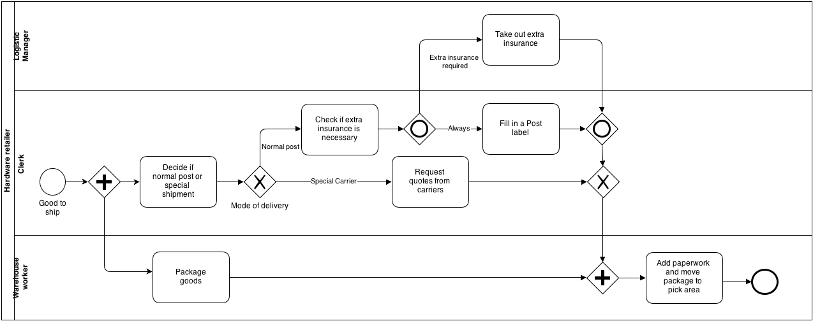

# Viewflow

**The low-code for developers with yesterday's deadline**

[![build]][build] [![coverage]][coverage] [![pypi-version]][pypi] [![py-versions]][pypi]

Viewflow is a low-code library for building business applications with Django.
It gives you ready-made components for user management, workflows, and
reporting. You write less code but keep full control. You can customize
everything and connect it to your existing systems.

Build full-featured business applications in a few lines of code. Viewflow ships
as one package with everything included. Each part works on its own, but they
all work well together.

GPT assisted with Viewflow documentation: [Viewflow Pair Programming Buddy][gpt]

Viewflow comes in two versions:

- **Viewflow Core:** Open-source library with base classes. Build your own solution on top.
- **Viewflow PRO:** Full package with ready-to-use features and third-party integrations. Commercial license allows private forks and modifications.



## Features

- Modern, responsive interface with SPA-style navigation
- Reusable workflow library for BPMN processes
- Built-in CRUD for complex forms and data
- Reporting dashboard included
- Small, easy-to-learn API

## Installation

Viewflow works with Python 3.10+ and Django 4.2+

Viewflow:

    pip install django-viewflow

Viewflow PRO:

    pip install django-viewflow-pro  --extra-index-url https://pypi.viewflow.io/<licence_id>/simple/

Add to INSTALLED_APPS in settings.py:

```python
    INSTALLED_APPS = [
        ....
        'viewflow',
        'viewflow.workflow',  # if you need workflows
    ]
```

## Quick start

Here is a pizza ordering workflow example.

### 1. Create a model for process data

Viewflow provides a Process base model. Use jsonstore fields to store data
without extra database joins:

```python

    from viewflow import jsonstore
    from viewflow.workflow.models import Process

    class PizzaOrder(Process):
        customer_name = jsonstore.CharField(max_length=250)
        address = jsonstore.TextField()
        toppings = jsonstore.TextField()
        tips_received = jsonstore.IntegerField(default=0)
        baking_time = jsonstore.IntegerField(default=10)

        class Meta:
            proxy = True
```

### 2. Create flows.py with your workflow

Define a flow class with steps. Use CreateProcessView and UpdateProcessView for
the forms:

```python

    from viewflow import this
    from viewflow.workflow import flow
    from viewflow.workflow.flow.views import CreateProcessView, UpdateProcessView
    from .models import PizzaOrder

    class PizzaFlow(flow.Flow):
        process_class = PizzaOrder

        start = flow.Start(
            CreateProcessView.as_view(
                fields=["customer_name", "address", "toppings"]
            )
        ).Next(this.bake)

        bake = flow.View(
            UpdateProcessView.as_view(fields=["baking_time"])
        ).Next(this.deliver)

        deliver = flow.View(
            UpdateProcessView.as_view(fields=["tips_received"])
        ).Next(this.end)

        end = flow.End()
```

### 3. Add URLs

Register the workflow with the frontend:

```python

    from django.urls import path
    from viewflow.contrib.auth import AuthViewset
    from viewflow.urls import Application, Site
    from viewflow.workflow.flow import FlowAppViewset
    from my_pizza.flows import PizzaFlow

    site = Site(
        title="Pizza Flow Demo",
        viewsets=[
            FlowAppViewset(PizzaFlow, icon="local_pizza"),
        ]
    )

    urlpatterns = [
        path("accounts/", AuthViewset().urls),
        path("", site.urls),
    ]

```

### 4. Run migrations and start the server

Run migrations, start Django, and open the browser. You can now create and track
pizza orders through the workflow.

Next steps: https://docs.viewflow.io/workflow/writing.html

## Documentation

Latest version: http://docs.viewflow.io/

Version 1.xx: http://v1-docs.viewflow.io

## Demo

http://demo.viewflow.io/

## Cookbook

Code samples and examples: https://github.com/viewflow/cookbook

## Stay updated

[Subscribe to our newsletter][newsletter] for release notes, Django low-code
tips, and notes on shipping business apps fast.

## License

Viewflow is an Open Source project licensed under the terms of the AGPL license - [The GNU Affero General Public License v3.0](http://www.gnu.org/licenses/agpl-3.0.html) with the Additional Permissions
described in [LICENSE_EXCEPTION](./LICENSE_EXCEPTION)

The AGPL license with Additional Permissions is a free software license that
allows commercial use and distribution of the software. It is similar to the GNU
GCC Runtime Library license, and it includes additional permissions that make it
more friendly for commercial development.

You can read more about AGPL and its compatibility with commercial use at the
[AGPL FAQ](http://www.affero.org/oagf.html)

If you use Linux already, this package license likely won't bring anything new to your stack.

Viewflow PRO has a commercial-friendly license allowing private forks and
modifications of Viewflow. You can find the commercial license terms in
[COMM-LICENSE](./COMM-LICENSE).

## Changelog

For older releases, see [CHANGELOG.rst](./CHANGELOG.rst).

## 2.3.2 2026-07-06

Security and data-integrity release. Highlights:

- Fix cross-flow privilege escalation and information disclosure: a user with
  only flow A's permission could cancel, or read the full task list of, flow B's
  process by posting/opening flow B's id on flow A's URL. `CancelProcessView` and
  `DetailProcessView` now scope their querysets to the view's own flow
- Fix the bulk-delete endpoint (`action/delete/`) deleting rows without checking
  login or the `delete` permission; add the missing authentication checks to the
  standalone `FlowChartView` and the `contrib.plotly` Dash endpoints
- Fix a transaction-ordering bug that committed partial writes next to a task's
  `ERROR` status in async mode; `Function`, `End`, `If`, `Split`, `Switch`,
  `Subprocess`, and `Join` activation now roll back cleanly on failure
- Fix a celery `Job` node treating `self.retry()`/`Reject` as a task failure and
  crashing on redelivery of a `STARTED` retry
- Fix task actions releasing their lock before the transaction commits, which let
  a concurrent request double-execute an action under `CacheLock`
- Fix `jsonstore` fields with a falsy `default` (`False`, `0`) returning `None`,
  discarding a falsy assigned value, and mis-sorting on `order_by()`
- Fix unbounded memory leaks in form rendering (widget-renderer cache keyed on the
  widget instance) and in `ListModelView` (`lru_cache` keyed on the view instance)
- Fix the "Administration" menu showing to every logged-in user instead of staff
- Fix several `viewflow.fsm` bugs: chart crashes on self-transitions, `State` with
  a custom getter replacing falsy-but-valid states, REST `transition` committing
  field writes on a failed transition or allowing arbitrary field writes; add a
  `chart/` state-chart view and action to `FlowViewsMixin`
- Fix a crash on the admin change page of any FSM-backed model under Django 5.2+
  (incl. 6.1) from the `change_form_fsm_tools` template tag
- Fix grouped `<select>` options under an `<optgroup>` being dropped, a formset
  validation bypass via a tampered ManagementForm, and `vf-field-select-multiple`
  dropping or failing to toggle selected values
- Fix a system check now warning when a flow has `Join` nodes but no real lock,
  and `manage.py check`/`runserver` crashing for a Join-node flow defined outside
  any installed app

## 2.3.1 2026-06-30

- Add Django 6.1 support
- Fix the bulk task assign/unassign actions not enforcing the per-task
  `can_assign`/`can_unassign` permission
- Fix task views accepting a task pk from another flow; tasks are now scoped to
  the flow in the URL

## 2.3.0 2026-06-30

- Fix `viewflow.fsm` chart generation crashing for `Enum` states and `State.ANY`
  markers (#476)
- Use the localized status label (`get_status_display`) in the default Task and
  Process briefs (#504)
- Add a `building-with-viewflow` skill for AI coding assistants (`skill/`, beta),
  and ship `llms.txt`, `llms-full.txt` and `AGENTS.md` on docs.viewflow.io (#498)
- Fix the `vf-field-input` `readonly` attribute not being treated as a boolean;
  it now defaults to `false` and is coerced like `disabled`/`required` (#499),
  applied consistently across the field widgets, and added `readonly` support to
  the password and textarea widgets
- Fix process cancel being allowed with only view permission; it now requires the
  `manage` permission. `has_view_permission`/`has_manage_permission` also honor
  object-level (e.g. django-guardian) permissions when an object is passed
- Make `Condition`/`Permission` generic over the flow type, so typed predicates
  like `Callable[[Publication], bool]` are accepted in `state.transition(...)`
- Update frontend and tooling dependencies to their latest within-major versions
- Upgrade the build to vite 7 and vite-plugin-static-copy 4; migrate the
  `@material` typography imports to the modern Sass `@use` API (generated CSS
  unchanged) and drop the unused `babel-core@4` dev dependency
- Upgrade `vanilla-jsoneditor` 0.23 → 3 (bundles svelte 5); the JSON field
  editor API is unchanged


[build]: https://img.shields.io/github/actions/workflow/status/viewflow/viewflow/django.yml?branch=main
[coverage]: https://img.shields.io/coveralls/github/viewflow/viewflow/v2
[travis-svg]: https://travis-ci.org/viewflow/viewflow.svg
[travis]: https://travis-ci.org/viewflow/viewflow
[pypi]: https://pypi.org/project/django-viewflow/
[pypi-version]: https://img.shields.io/pypi/v/django-viewflow.svg
[py-versions]: https://img.shields.io/pypi/pyversions/django-viewflow.svg
[requirements-svg]: https://requires.io/github/viewflow/viewflow/requirements.svg?branch=v2
[requirements]: https://requires.io/github/viewflow/viewflow/requirements/?branch=v2
[gpt]: https://chatgpt.com/g/g-8UHAnOpE3-viewflow-pair-programming
[newsletter]: https://robustarush.substack.com/?utm_source=github&utm_medium=readme&utm_campaign=viewflow_oss
