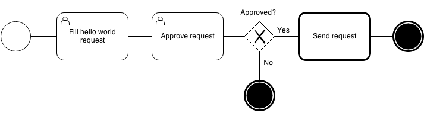

=====================
Viewflow Hello, World
=====================

http://examples.viewflow.io/workflow/helloworld/

Hello world process, where one could start "hello, world" request,
another person approves it. and if the request was approved the
background celery job sends it to the world.

